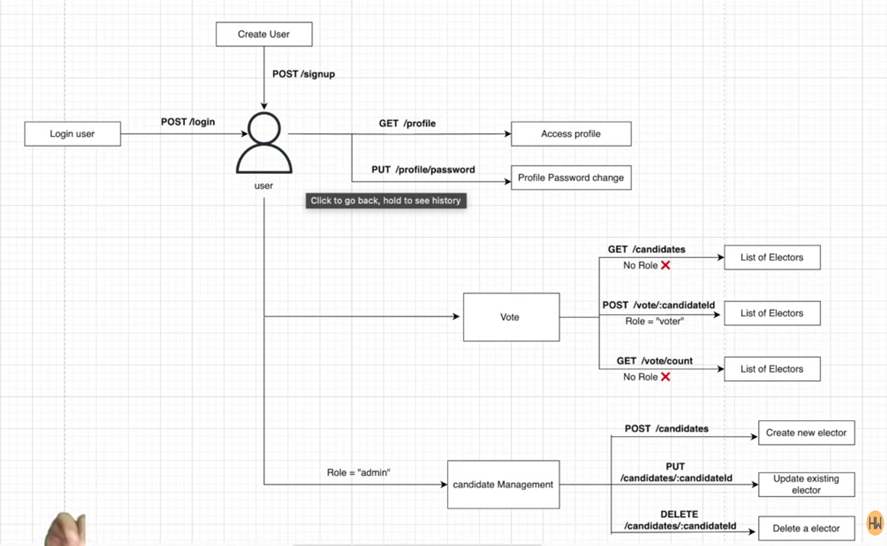

# 🗳️ Voting System (Node.js + Express + MongoDB)

A backend **Voting Application** built using **Node.js**, **Express**, and **MongoDB** that allows users to register, log in, and vote for candidates — with proper authentication, admin control, and live vote counting.

---

## 📘 Project Overview

This project provides a secure and RESTful API for a voting system.  
Users can sign up, view available candidates, and cast their vote **(only once)**.  
An **admin** manages the entire process, including adding, updating, and deleting candidates.

---


## ⚙️ Features

- 🔐 **User Authentication** using JWT  
- 🪪 **NID-based Login System**  
- 👥 **Admin & Voter Roles**  
- 🧾 **Candidate Management (Admin only)**  
- 🗳️ **Single Vote Restriction per User**  
- 📊 **Live Vote Count Display**  
- 🔄 **Password Change Option**  
- 🧱 **Secure Password Hashing (bcrypt)**  

---

## 🧱 Models

### **User Model**
- name  
- age  
- email  
- mobile  
- address  
- nidCardNumber *(unique)*  
- password *(hashed)*  
- role *(voter/admin)*  
- isVoted *(boolean)*

### **Candidate Model**
- name  
- age  
- votes *(Array of user references + timestamps)*  
- voteCount *(Number)*  

---

## 🚏 Routes & Endpoints

### 🔹 **User Authentication**
| Method | Endpoint | Description |
|--------|-----------|-------------|
| `POST` | `/user/signup` | Create a new user account |
| `POST` | `/user/login` | Login using NID card number and password |

---

### 🔹 **Voting**
| Method | Endpoint | Description |
|--------|-----------|-------------|
| `GET` | `/candidate/count ` | View list of all candidates and their party name |
| `POST` | `/candidate/vote/:candidateId` | Vote for a specific candidate (only once) |

---

### 🔹 **Vote Counts**
| Method | Endpoint | Description |
|--------|-----------|-------------|
| `GET` | `/candidate/vote/count` | Get all candidates sorted by vote count |

---

### 🔹 **User Profile**
| Method | Endpoint | Description |
|--------|-----------|-------------|
| `GET` | `/user/profile` | Get user’s profile information |
| `PUT` | `/user/profile/password` | Change user password |

---

### 🔹 **Admin Candidate Management**
| Method | Endpoint | Description |
|--------|-----------|-------------|
| `POST` | `/candidate` | Add a new candidate |
| `PUT` | `/candidate/:candidateId` | Update candidate information |
| `DELETE` | `/candidate/:candidateId` | Delete a candidate |

---

## 🔐 Role Restrictions
- **Admin**: Can create, update, and delete candidates — cannot vote.  
- **Voter**: Can view candidates and vote once.

---

## 🧩 Flow Diagram



---
## 🛠️ Technologies Used
- Node.js  
- Express.js  
- MongoDB (Mongoose)  
- JWT (Authentication)  
- bcrypt (Password Hashing)  
- dotenv (Environment Variables)

---

## 🚀 Setup Instructions

1. **Clone the repository**
   ```bash
   git clone https://github.com/yourusername/voting-system.git
   cd voting-system
